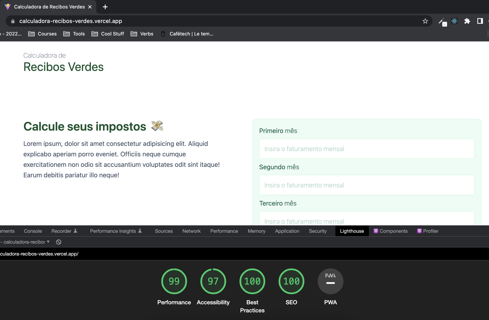

<h1 align="center">
    Calculadora de Recibos Verdes
</h1>



<p align="center">
  
  <br />
  
  <br />
    
</p>

<p align="center">
    <a href="https://calculadora-recibos-verdes.vercel.app/" target="_blank">Click here to see the live demo!</a>&nbsp;&nbsp;&nbsp;
</p>

## Description
A tax calculator related to issuing Green Receipts in Portugal. I've created to test Tailwind CSS with Vite. It was a practical and fast development process.
## User stories
- User can add data into the form;
- User can see the results based on the input;

## How to install:
```
git clone https://github.com/kdumagalhaes/calculadora-recibos-verdes
```
```
npm install
```
```
npm run dev
```

## How to test:
```
npm run test
```
## Requirements:
- Node's latest version installed on your machine.
- https://nodejs.org/en/download/

## Technologies

- [ReactJS](https://reactjs.org/)
- [Vite](https://vitejs.dev/)
- [TypeScript](https://www.typescriptlang.org/)
- [Tailwind CSS](https://tailwindcss.com/)
- [Vitest](https://vitest.dev/)
- [React Testing Library](https://testing-library.com/docs/react-testing-library/intro/)
- [resize-observer-polyfill](https://www.npmjs.com/package/resize-observer-polyfill)

## Improvement opportunities
- [x] Refactor form logic;
- [ ] Add small UI improvements;
- [ ] Add user authentication;
- [ ] Persist user data to present a history;

Made by [Carlos](https://www.linkedin.com/in/kdumagalhaes/) :wave:
